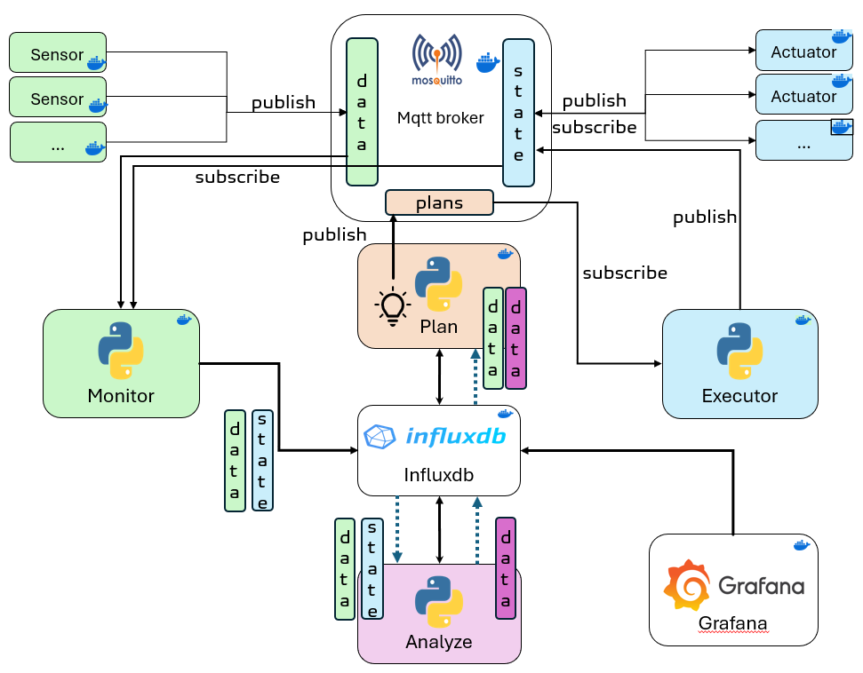

# An AS to manage an Hydropower reservoir

## Project Overview
The project is inspired by infrastructures consisting of a water reservoir and a hydroelectric power plant located downstream using IoT technologies, MQTT, InfluxDB and Grafana.

## MAPE-K architecture for the system
- **Managed resources:** 
  
  **- Sensors** Simulate inbound, level of the lake, outbound, gate opening.

  **- Actuators** opening percentage of the gates.

- **Monitor:** It handles changing conditions provided by the sensors  data and ensures outdated data is removed. It keeps the data in InfluxDB updated..
- **Analyze:** It processes all the data from InfluxDB. Processing data involves validating it, detecting anomalies, and generating insights into how the system is performing.
- **Plan:** It balance inflow and outflow while adhering to operational constraints. Using real-time sensor data, predictions, and historical trends from InfluxDB, it dynamically adjusts actions like gate operations and pumped storage to prevent overflow, maintain reservoir stability, and optimize resource use, adapting to scenarios based on water levels and predictive thresholds.
- **Execute:** It implements plans by adjusting gates, activating pumps, and monitoring outcomes. It swiftly adapts to unexpected changes, ensuring the system remains on track publishing data on MQTT.
- **Knowledge:** built on InfluxDB, serves as a centralized repository for real-time sensor data, historical trends, and predictions, supporting decision-making in the MAPE-K loop. It provides accurate, up-to-date information for components like the Planner and Analyzer, enabling efficient dam operations and real-time responsiveness to environmental changes.

## Predicted_data


## System architecture



## Installation and Setup
1. **Clone the Repository:**
```
git clone https://github.com/oobooee/Univaq_Se4AS_Project.git
```
2. **Start Docker Containers:**
```
docker-compose up 
```

3. **Dashboard:**
visit http://localhost:3000/ and select Se4AS_Dashboard from Dashboards

## System architecture


## Configuration Details
- **MQTT Topics:** Defined in the `.env` file for dynamic subscriptions.
- **InfluxDB Setup:** Bucket and authorization token configured for data storage.


